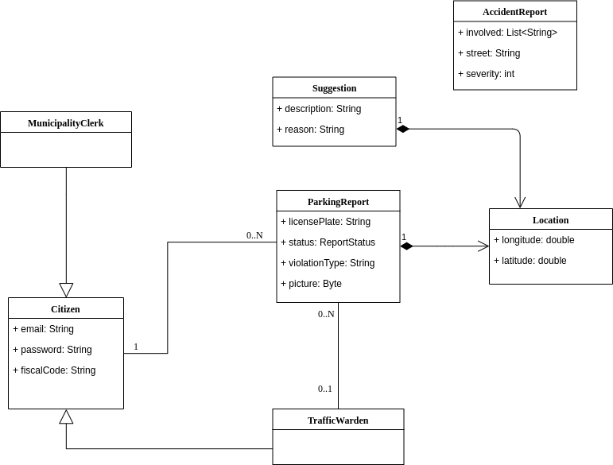
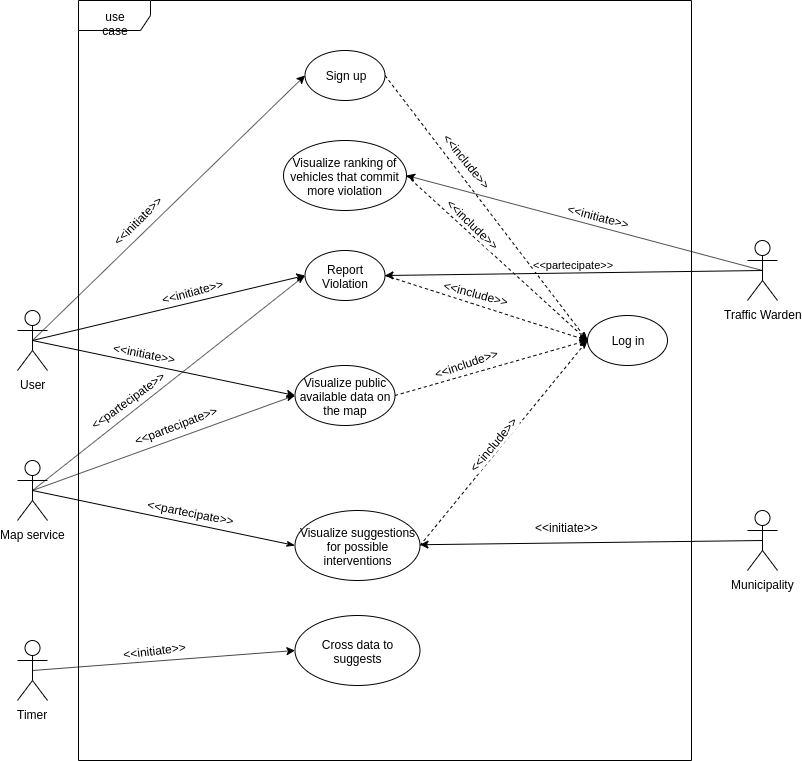
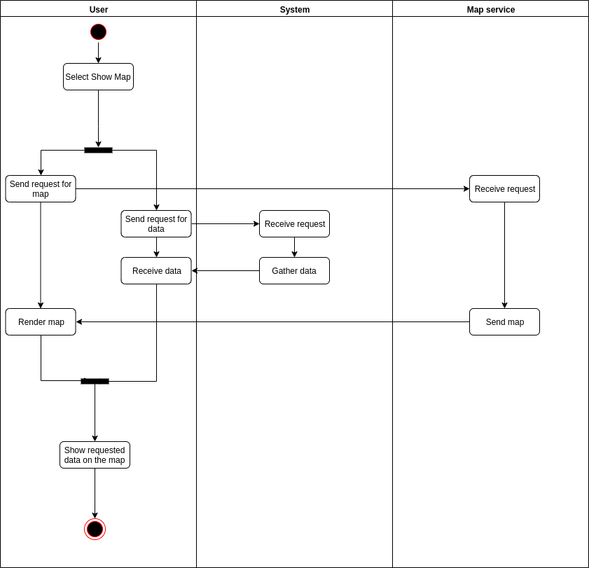
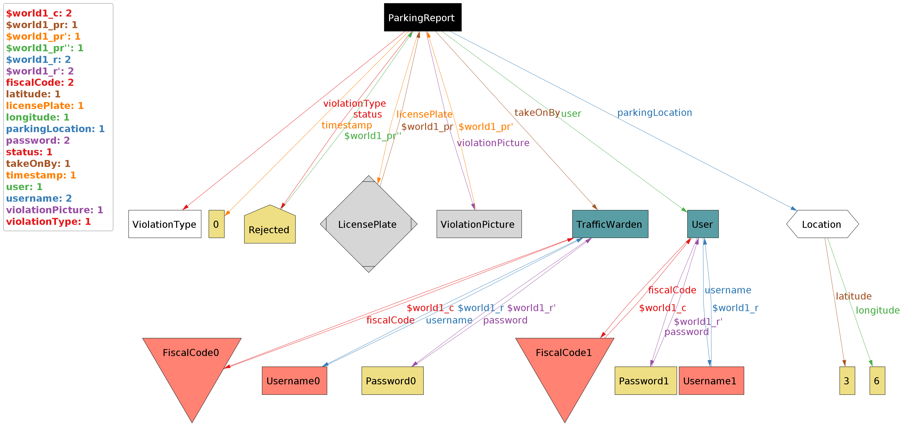
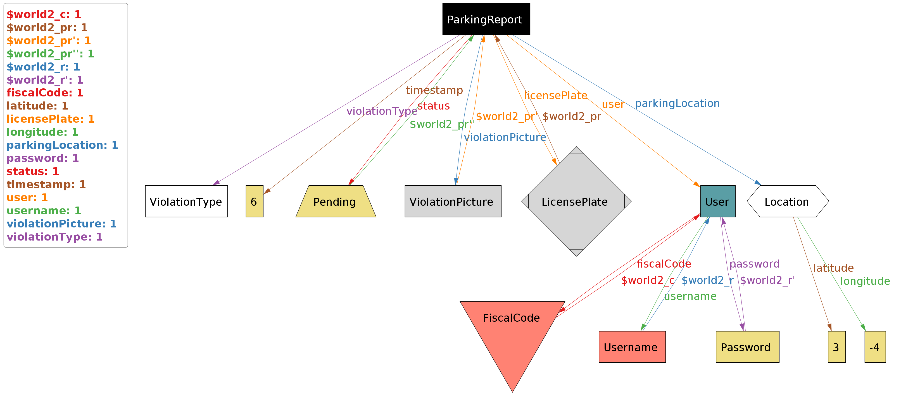
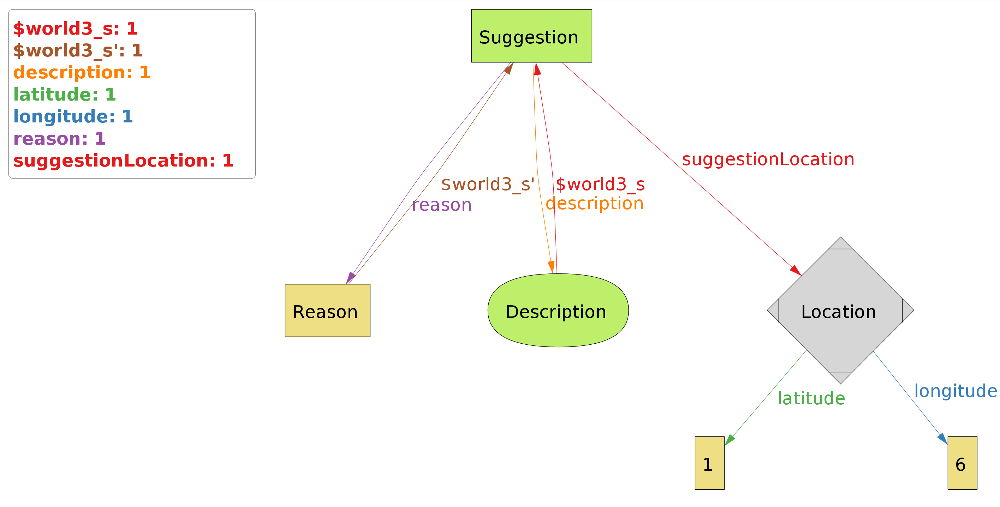

# Requirements Analysis and Specifications Document
<br>


<br>
###### Version 1.1

<br>

#### Authors

* Federico Cazzola (mat. _945835_)
* Francesco Dotti (mat. _945232_)

### Table of contents

1. [**INTRODUCTION**](#1)
    1. [Purpose](#1.1)
    2. [Scope](#1.2)
    3. [Definitions, Acronyms, Abbreviations](#1.3)
    4. [Revision history](#1.4)
    5. [Reference Documents](#1.5)
    6. [Document Structure](#1.6)
2. [**OVERALL DESCRIPTION**](#2)
    1. [Product perspective](#2.1)
    2. [Product functions](#2.2)
    3. [User characteristics](#2.3)
    4. [Assumptions, dependencies and constraints](#2.4)
3. [**SPECIFIC REQUIREMENTS**](#3)
    1. [External Interface Requirements](#3.1)
        1. [User Interfaces](#3.1.1)
        2. [Hardware Interfaces](#3.1.2)
        3. [Software Interfaces](#3.1.3)
        4. [Communication Interfaces](#3.1.4)
    2. [Functional Requirements](#3.2)
        1. [Scenarios](#3.2.1)
        2. [Use cases](#3.2.2)
        3. [Requirements](#3.2.3)
    3. [Performance Requirements](#3.3)
    4. [Design Constraints](#3.4)
        1. [Standards compliance](#3.4.1)
        2. [Hardware limitations](#3.4.2)
        3. [Any other constraint](#3.4.3)
    5. [Software System Attributes](#3.5)
        1. [Reliability](#3.5.1)
        2. [Availability](#3.5.2)
        3. [Security](#3.5.3)
        4. [Maintainability](#3.5.4)
        5. [Portability](#3.5.5)
4. [**FORMAL ANALYSIS USING ALLOY**](#4)
5. [**EFFORT SPENT**](#5)

<a name="1"></a>
# 1 INTRODUCTION

<a name="1.1"></a>
## 1.1 Purpose
This document is the Requirement Analysis and Specification Document (RASD). Goals of this document are to completely describe the system in terms of functional and non-functional requirements, analyze the real needs of the customer in order to model the system, show the constraints and the limit of the software and indicate the typical use cases that will occur after the release. This document is addressed to the developers who have to implement the requirements and could be used as a contractual basis.
### 1.1.2
The goals of the projects are:
<a name="G1"></a>
- [G1] The system must allow users to send a report of violations
<a name="G2"></a>
- [G2] The system must allow all users to mine the information that has been received by highlighting the streets (or the areas) with the highest frequency of violations
<a name="G3"></a>
- [G3] The system must allow authorities to mine the information that has been received to see the ranking of vehicles that commit more violations
<a name="G4"></a>
- [G4] The system must cross the information provided by the municipality about the accidents with its own data to identify potentially unsafe areas and suggest possible interventions.

<a name="1.2"></a>
## 1.2 Scope
The SafeStreet service is offered to common users that want to help the community.	
The S2B will give to the user the possibility to report traffic violation, in particular, parking violation (eg. parking in a spot reserved for disabled people, parking in an helicopter pitch, parking on the sidewalk). The system will allow the users to select the type of violation leading to differt amount of ticket value. 
The system will help the authorities to identify more infractions and therefore to issue more tickets which should increase the attention and respect of the citizens regarding the traffic rules.
Furthermore thanks to the increased number of ticket the municipality will have more money to invest in the community. This extra money could be used to do some interventions following the suggestions provided by SafeStreets.

<a name="1.3"></a>
## 1.3 Definitions, Acronyms, Abbreviations
- **Mine**: to process data for obtaining new data
- **Violation**: an infringement of the rules
- **Unsafe area**: area where often happen violation and accident
- **FOSS**: free and open source software
- **S2B**: software to be
- **RASD**: Requirements Analysis and Specifications Document  
- **DD**: Design Document
- **API**: Application programming interface
- **NIST**: National Institute of Standards and Technology
- **RFC**: Request for Comments

<a name="1.4"></a>
## 1.4 Revision history
 - **Version 1.0** <br>
 Inital version
 - **Version 1.1** <br>
   Update diagrams and shared phenomenon table <br>
 - **Version 1.2** <br>
   Minor fix in the alloy model <br>

<a name="1.5"></a>
## 1.5 Reference Documents
- Specification document: “SafeStreets Mandatory Project Assignment” 	
- [ISO/IEC/IEEE 29148:2018](https://ieeexplore.ieee.org/document/8559686)
- [UML diagrams](https://www.uml-diagrams.org/)
- [Alloy documentation](http://alloy.lcs.mit.edu/alloy/documentation/quickguide/seq.html)
  
<a name="1.6"></a>
## 1.6 Document Structure
- **Chapter 1** Presents an introduction to the problem and describes the purpose of the application. The scope of the application is defined by stating the goals and description of the problem.
- **Chapter 2** Presents the overall description of the project. The product perspective includes an high level Class diagram and details on the shared phenomena and the domain models. Also it's Provided a summary of the major functions that the software will perform. In the user characteristics section are listed the types of actors that interface with the system.
- **Chapter 3** Contains the external interface requirements (user interfaces, hardware interfaces, software interfaces and communication interfaces). The functional requirements are defined with use case and activity diagram.
The non-functional requirements are defined through performance requirements, design constraints and software system attributes.
- **Chapter 4** Introduces an alloy model and the diagrams of some worlds generated from it.
- **Chapter 5** Shows the effort spent by each group member.

<a name="2"></a>
# 2 OVERALL DESCRIPTION

<a name="2.1"></a>
## 2.1 Product perspective

The following high level class diagram provides a model of the application domain: it contains only few essential attributes of the various classes and may not include every class that will be necessary to define the Model (useful data) of the system.



### World and Machine

| Phenomenon | Shared | Who controls it  |
| --- | --- | --- |
| User wants to report a parking violation | N | W |
| User takes a photo of the car commiting a violation | Y | W |
| User submits a report | Y | W |
| The system recognizes the license plate | N | M | 
| User signs up| Y | W |
| The system verifies and accept / refuse data inserted to registrate | N | M |
| User logs in on the application | Y | W |
| The system verifies and accept / refuse data inserted to log in| N | M |
| Traffic warden wants to find a car parked illegaly | N | W |
| Traffic warden sees a notification about a possible violation| Y | M |
| Traffic warden confirms a violation | Y | W |
| The system gets and stores data about a violation | N | M |
| The system crosses his data with municipality's data | N | M |
| The system runs an algorithm to generate possible suggestions | N | M |
| A municipality's clerk wants to the see suggestions for possible interventions | N | W |
| Municipality's clerk search for the area he's insterested about the suggestions | Y | W |
| The system shows information about possible informations | Y | M |
| The system shows the map | Y | M |


<a name="2.2"></a>
## 2.2 Product functions

Here it's Provided a summary of the major functions that the software will perform.

### Report parking violation
This is the main function of the system: The software will allow users to notify authorities when traffic violations occur, and in particular parking violations. The application allows users to send pictures of violations, including their date, time, and position to authorities. Examples of violations are vehicles parked in the middle of bike lanes or in places reserved for people with disabilities, double parking, and so on.

### Mine information
The S2B must gather all the reports of the parking violation and elaborate them with an algorithm to highlighting the streets (or the areas) with the highest frequency of violations, or the vehicles that commit the most violations. The system will allow only police officers to access some kind of data (e.g. information about a specific vehicle), while more generic data will be available for every user.

### Suggest interventions
The S2B must gather information about accidents that the municipality will provide and cross them with his parking violation reports to generate new data about potentially unsafe area. Those potentially unsafe areas and the suggestions for possibile interventions (elaborated by an algorithm), will be made available for the municipality's clerks, which may use those suggestion to take actions.

<a name="2.3"></a>
## 2.3. User characteristics

### 1. User
Common citizen who signs up to use the SafeStreet service. There are no constraints or age limitations, anyone can join.
The user is a person who use the app to report a parking violation.

### 2. Traffic Warden
A police officer. The sign up process is made in collaboration with the authorities to guarantee their identity. He has to take on and verify the violations. Also he can access the ranking of vehicles that commited violations.

### 3. Municipality's clerk
Certified municipality's clerk who can access the suggestions for possible interventions.

<a name="2.4"></a>
## 2.4 Assumptions, dependencies and constraints
- **D1**: All traffic wardens have a smartphone.
- **D2**: Each fiscal code number is unique.
- **D3**: The municipality will provide only well formatted report of accidents.
- **D4**: The map provider will provide only well formatted data.

<a name="3"></a>
# 3 SPECIFIC REQUIREMENTS
<a name="3.1"></a>
## 3.1 External Interface Requirements

<a name="3.1.1"></a>
### 3.1.1 User Interfaces
User interfaces are described in detail in the DD.
<a name="3.1.2"></a>
### 3.1.2 Hardware Interfaces 
- The software, in order to work, will need an internet connection so the device must have access to the internet.
- A standard user will need a device with GPS to capture the exact location and a camera to take the photo in order to report a traffic violation.
<a name="3.1.3"></a>
### 3.1.3 Software Interfaces 
- Safestreets will be available as a web application: so any modern up-to-date browser will be compatible (e.g. Firefox, Brave) and as a native app for Android and iOS (Android 4.4 and iOS 9.3 will be the oldest versions supported)
- Safestreets will use a map service to work with geographic data (maps and addresses).

<a name="3.1.4"></a>
### 3.1.4 Communication Interfaces 
The various components communicate via the internet.

<a name="3.2"></a>
## 3.2 Functional Requirements

<a name="3.2.1"></a>
### 3.2.1 Scenarios:

- ### Scenario 1  
  Marco is tired of people parking on the sidewalk near his shop, so instead of shouting or starting a discussion with the violator, he decides to report the violation to SafeStreet using the application on his smartphone. He takes a photo of the violation and sends it, a lot better than calling emergency number only to report a parking violation.

- ### Scenario 2  
  The budget of the municipality of Milan is negative, therefore, Omar, mayor of Milan, needs to find a way to raise more money. After a meeting with the head of the municipal police, who wants to improve his operate, he learns about SafeStreets and decides to adopt it in his city. Thanks to the application the traffic wardens will be more efficient and the number of traffic tickets should increase accordingly.
 
- ### Scenario 3  
   Giuseppe the assessor wants to know where public interventions are most needed. Thanks to SafeStreet he can check out the suggestions provided by the advanced algorithm developed by SafeStreet. 

- ### Scenario 4  
  Award-winning traffic warden Nicola was commissioned by his superiors to use the SafeStreets application to get the notifications about traffic violations occurring near his position.
  Thanks to the application he can forget about imprecise indications and can now precisely reach the position to control the situation.

### Use Case Diagram


<a name="3.2.2"></a>
### 3.2.2 Use cases:

| Name | SignUp |  
| --- | --- |
| **Actor** |  User |
| **Entry condition** |  The user has opened the application on his device. |
| **Events flow** | 1. The user chooses the “Sign up” option.	<br> 2. The user fills the mandatory fields. <br> 3.The user fills the optional fields with not mandatory data.	<br> 4. The user chooses the confirmation option. <br> 5.The system save the data.|
| **Exit condition** | The user is registered and the system has his data stored  |
| **Exception** | 1. The user was already registered. In this case the system warns the user and suggests him/her to do the login.<br> 2.   The username is already taken. In this case the system warns the user and suggests him to change the username. <br> 3. The username doesn’t fill all the mandatory fields. In this case the system warns the user and notifies him which fields were left unfilled. <br> 4. No internet connection. The system suggests to check network configuration or to reconnect. |

<br>
<br>

| Name | Log in |  
| --- | --- |
| **Actor** |  User |
| **Entry condition** |  The user has opened the application on his device. |
| **Events flow** | 1. The user enters username and password. <br> 2. The user decides if he wants to be remembered by the system clicking on the relative switch.<br> 3. The user clicks ”LOGIN”. <br> 4. If the user chose to be remembered, next time the use case ends without asking username and password.  |
| **Exit condition** | User is logged in and in the home page of the application with the possibility to use function based on his account privileges. |
| **Exception** | 1. The user enters invalid data. <br> 2. The user leaves blank at least one field. <br> In both cases the system warns the user suggesting him to insert correct data. <br> 3. No internet connection. The system suggests to check network configuration or to reconnect. |

<br>
<br>

| Name | Report Violation |  
| --- | --- |
| **Actor** | User, Traffic Warden |
| **Entry condition** |  The user and the traffic warden has already done the Log in activity. |
| **Events flow** | 1. The user chooses the “CREATE REPORT” option. <br> 2. The user selects the violation type.<br> 3. The user takes a picture of the violation. <br> 4. The system shows the license plate. <br> 5. The user checks if the license plate of the vehicle recognized from the picture is correct otherwise edits it. <br> 6. The system shows the location provided by the GPS on a map. <br> 7. The user checks if the location provided by the app is correct otherwise fixs it. <br> 8. The user uploads the data clicking on "Upload" <br> 9. The system sends a notification to the traffic warden. <br> 10. The traffic warden selects the report from the list of reports. <br> 11. The traffic warden clicks on "Take on". <br> 12. The traffic warden checks if the violation exists, if it does clicks on "Verify" otherwise clicks on "Fail" |
| **Exit condition** | The traffic warden has checked if the violation exist |
| **Exception** | 1. No internet connection. The system suggests to check network configuration or to reconnect. |

<br>
<br>

| Name | Visualize public available data on the map |  
| --- | --- |
| **Actor** |  User |
| **Entry condition** |  The user is logged in and in the homepage |
| **Events flow** | 1. The user cliks on "SHOW MAP". <br> 2. The system loads the map of the city. <br> 3. The user can search for a specific location and select from a menu which kind of data he wants to see. |
| **Exit condition** | The requested information is showed on the map |
| **Exception** | 1. No internet connection. The system suggests to check network configuration or to reconnect. |

<br>
<br>

| Name | Visualize ranking of vehicles that commit more violations |  
| --- | --- |
| **Actor** |  Traffic Warden |
| **Entry condition** |  The traffic warden is logged in and in the homepage |
| **Events flow** | 1. The traffic warden cliks on "Show Ranking". <br> 2. The system loads the leaderboard with the license plate. <br> 3. The police warden can add filter (e.g. filter by violation type). |
| **Exit condition** | The requested information is showed |
| **Exception** | 1. No internet connection. The system suggests to check network configuration or to reconnect. |

<br>
<br>

| Name | Visualize suggestions for possible interventions |  
| --- | --- |
| **Actor** | Municipality |
| **Entry condition** | Muncipality's employee is logged in |
| **Events flow** | 1. The employee cliks on "Suggestions 4 interventions". <br> 2. The system loads the map of the city and the suggestions for the visualized area. <br> 3. The employee can search for a specific location, view the list of suggestions. <br> 4. If the employee clicks on a particular suggestion he can check its details. |
| **Exit condition** | The requested suggestion is displayed. |
| **Exception** | 1. No internet connection. The system suggests to check network configuration or to reconnect. |

<br>
<br>

| Name | Cross data to suggests possbile interventions |  
| --- | --- |
| **Actor** | No human actors: SafeStreets backend and Municipality servers |
| **Entry condition** | Automated activity triggered by a timer |
| **Events flow** | 1. The system contacts Municipality's database asking to send data if new data is available since the prevoius time. <br> 2. The municipality's DB replies sending the data. <br> 3. The System crosses his data with the received and starts an algorithm that identifies unsafe areas and generates possible interventions. <br> 4. The suggestions list is updated.
| **Exit condition** | Suggestions are updated. |
| **Exception** | 1. No internet connection. The system suggests to check network configuration or to reconnect. <br> 2. Municipality's server is not reachable. |

### Activity diagrams

#### User reports violation


#### Traffic warden verifies violation report


#### Visualize public available data on the map



<a name="3.2.3"></a>
### 3.2.3 Requirements
In this section we show that the requirements ensure the satisfaction of the goals in the context of the domain assumptions: the list of requirements and domain assumptions under each goal have this purpose.

**[G1] The system must allow users to send a report of violations** 
- **R1** The system has to allow sign up of new users.
- **R2** The system has to allow users to login.
- **R3** The system must allow users to send pictures of violations, including their date, time, and position to authorities.
- **R4** The system, when it receives a picture, must run an algorithm to read the license plate.
- **R5** The system must allow the user to fix the license plate if the algorithm read it wrong.
- **R6** The system must allow the user to fix the location if the GPS acquired the wrong location.
- **R7** The system must store the information of the report sent by the users.
- **R8** The system must send a notification to the traffic warden.
- **R9** The system has to allow one traffic warden to "take on" the report.
- **R10** The system has to allow the traffic warden to validate or to invalidate the report.
- **D1** All traffic wardens have a smartphone.
- **D2** Each fiscal code number is unique.
- **D4** The map provider will provide only well formatted data.

**[G2] The system must allow all users to see highlighting the streets (or the areas) with the highest frequency of violations** 
- **R1** The system has to allow sign up of new users.
- **R2** The system has to allow users to login.
- **R11** The system must mine the reports to higlight the streets (or the areas) with the highest frequency of violations.
- **R12** The system has to allow search for a specific location and select from a menu which kind of data he wants to see.
- **D4** The map provider will provide only well formatted data.

**[G3] The system must allow authorities to see the ranking of vehicles that commit more violations**
- **R2** The system has to allow user to login.
- **R13** The system must distinguish privilege of account (normal, traffic warden, municipality clerk).
- **R14** The system must mine the reports to create a ranking of the vehicles that commit more violation.
- **D1** All traffic wardens have a smartphone.

**[G4] The system must cross the information provided by the municipality about the accidents with its own data to identify potentially unsafe areas and suggest possible interventions**
- **R2** The system has to allow user to login.
- **R13** The system must distinguish privilege of account (normal, traffic warden, municipality clerk).
- **R15** The system must gather data about accidents from the municipality.
- **R16** The system must cross the information provided by the municipality about the accidents with its own data to identify potentially unsafe areas.
- **R17** The system must show possible interventions to improve unsafe area.


### Tracebility Matrix

In the following table we are going to map, for	each requirement, all the use cases which are related to it.

| Requirement | Use Case |  
| --- | --- |
| R1 | SignUp |
| R2 | Log in |
| R3 | Report Violation |
| R4 | Report Violation |
| R5 | Report Violation |
| R6 | Report Violation |
| R7 | Report Violation |
| R8 | Report Violation |
| R9 | Report Violation |
| R10 | Report Violation |
| R11 | Visualize public available data on the map |
| R12 | Visualize public available data on the map |
| R13 | Visualize ranking of vehicles that commit more violations <br> Visualize suggestions for possible interventions |
| R14 | Visualize ranking of vehicles that commit more violations |
| R15 | Cross data to suggests possbile interventions |
| R16 | Cross data to suggests possbile interventions |
| R17 | Visualize suggestions for possible interventions |

<a name="3.3"></a>
## 3.3 Performance Requirements
The backend system must be able to serve requests of many clients simultaneously and be scalable in order to handle without problems the high volume of requests that will come with the increasing number of subscriptions. Especially if the S2B will be adopted in multiple towns.<br>
The client applications must be very lightweight and simple in order to run smoothly on every supported device.

<a name="3.4"></a>
## 3.4 Design Constraints
<a name="3.4.1"></a>
### 3.4.1 Standards compliance
Individual countries have their own privacy laws so the system must be compliant with privacy laws in the states where it will be distributed. System must ask the customer to accept a statement that describes the term of service during the registration.<br>
The system must respect the local traffic laws and ordinances of the towns where it will be distributed.<br>
The web app must follow W3C standards.<br>
Native apps must respect Android / iOS quality guidelines and standards.<br>

<a name="3.4.2"></a>
### 3.4.2 Hardware limitations
Any compatible device that support iOS or Android versions ( defined in the [Software Interfaces](#3.1.3) section ) will be able to run the application smoothly and also have GPS, camera and internet connection as specified in the [Hardware Interfaces](#3.1.2) section.<br> 
Users internet connection speed with SafeStreets servers should be at least 100kbps to have a pleasant experience.<br>
Safestreets servers must have access at least to a symmetric gigabit internet connection.

<a name="3.4.3"></a>
### 3.4.3 Any other constraints
There aren't other constraints.

<a name="3.5"></a>
## 3.5 Software System Attributes
<a name="3.5.1"></a>
### 3.5.1 Reliability
Redundancy and process resilience is expected to be used by the components of the system backend in order to guarantee a low failure rate. 

<a name="3.5.2"></a>
### 3.5.2 Availability
In order to guarantee high reliability, the system is expected to offer an ideal 24/7 service. At least a 99.5% ("two nines five") availability must be guaranteed (1.83 days/year downtime). <br>

<a name="3.5.3"></a>
### 3.5.3 Security
 - All connections must use strong encryption using TLS/SSL in the most secure ways. Everything must be compliant to the latest standards specified in various RFCs and NIST papers.
 - Users password must be stored using proper technique adding salt, pepper and then use a strong hash function like bcrypt.
 - The data stored contains sensitive information so the security aspect is	of primary	importance, all disks used for storage must be encrypted.
 - All data stored by the app on the user device must be encrpyted so other apps can't read it.
 
<a name="3.5.4"></a>
### 3.5.4 Maintainability
Maintenance is expected not to interfere with normal use of the Safrstreets service. Extraordinary maintenance that require to stop the service should be done when the service is rarely used (early morning) and completed in less than 2 hours.

<a name="3.5.5"></a>
### 3.5.5 Portability
The web application will be supported by any modern browser (Firefox, Brave, etc...)<br>
Native apps for Android and iOS will be available. (As defined in the [Software Interfaces](#3.1.3) section ) 

<a name="4"></a>
# 4 FORMAL ANALYSIS USING ALLOY

Here is an analysis	of some critical aspects of the	system using Alloy. Some of the features of the system are specified and
explained in more details, in particular the focus is on the following constraints:


```alloy
--signatures

sig FiscalCode{}
sig Username{}
sig Password{}
sig User{
    username: one Username,
    password: one Password,
    fiscalCode: one FiscalCode
}

sig TrafficWarden extends User{
}

sig Location{
    latitude: one Int,
    longitude: one Int
}

--{latitude >= -90 and latitude <= 90 and longitude >= -180 and longitude <= 180}
--NB: scaled values for simplicity
{latitude >= -3 and latitude <= 3 and longitude >= -6 and longitude <= 6 }

abstract sig ParkingReportStatus {}
sig Approved , Pending , Rejected extends ParkingReportStatus {}

sig LicensePlate{}

sig ViolationType{}

sig ViolationPicture{}

sig ParkingReport{
    licensePlate: one LicensePlate,
    violationType: one ViolationType,
    violationPicture: one ViolationPicture,
    timestamp: one Int,
    parkingLocation: one Location,
    user: one User,
    takeOnBy: lone TrafficWarden,
    status: one ParkingReportStatus
}
{ timestamp >= 0 }

sig Description{}
sig Reason{}

sig Suggestion{
    suggestionLocation: one Location,
    description: one Description,
    reason: one Reason
}

--facts

--All FiscalCodes have to be associated to a User
fact FiscalCodeUserConnection{
    all fc: FiscalCode | some c: User | fc in c.fiscalCode
}

--All Usernames have to be associated to a User
fact UsernameUserConnection{
    all u: Username | some r: User | u in r.username
}


--All Passwords have to be associated to a User
fact PasswordUserConnection{
    all p: Password | some r: User | p in r.password
}


--Every User has a unique username
fact NoSameUsername {
    no disj u1,u2: User | u1.username = u2.username
}

--There are no ParkingReport on the same vehicle within 1 hour in the same location
fact NoParkingReportWithin1HourInTheSameLocation {
    no disj pr1,pr2 : ParkingReport | pr1.licensePlate = pr2.licensePlate and pr1.parkingLocation = pr2.parkingLocation and 
    (pr1.timestamp < pr2.timestamp and (pr1.timestamp + 3600) > pr2.timestamp)
}

--Every User has a unique FiscalCode
fact NoSameFiscalCode {
    no disj c1,c2 : User | c1.fiscalCode = c2.fiscalCode
}

--All LicensePlate have to be associated to a ParkingReport
fact LicensePlateParkingReportConnection{
    all lp: LicensePlate | some pr: ParkingReport | lp in pr.licensePlate
}

--All ViolationPicture have to be associated to a ParkingReport
fact ViolationPictureParkingReportConnection{
    all vp: ViolationPicture | some pr: ParkingReport | vp in pr.violationPicture
}

--All Description have to be associated to a Suggestion
fact DescriptionSuggestionConnection{
    all d: Description | some s: Suggestion | d in s.description
}

--All Reason have to be associated to a Suggestion
fact ReasonSuggestionConnection{
    all b: Reason | some s: Suggestion | b in s.reason
}

--All Location have to be associated to a Suggestion or a ParkingReport
fact LocationSuggestionParkingReportConnection{
    all l: Location | (some s: Suggestion | l in s.suggestionLocation) or (some pr: ParkingReport | l in pr.parkingLocation)
}


--All ParkingReportStatus have to be associated to a ParkingReport
fact ParkingReportStatusParkingReportConnection{
    all prs: ParkingReportStatus | some pr: ParkingReport | prs in pr.status
}

--Status in ParkingReport have to be Pending if there is no takeOnBy
fact ParkingReportStatusPendingIfNoTakeOn{
    all pr: ParkingReport | pr.takeOnBy = none implies pr.status = Pending
}


--Every ParkingReport has a unique Picture
fact NoSamePicture {
    no disj p1,p2: ParkingReport | p1.violationPicture = p2.violationPicture
}

--Assertions

--It should not be possible to have different ParkingReports on the same vehicle in the same location in the range of a hour
assert noParkingReportOnSameVehicleWithinAnHourInTheSameLocation {
    no disj p1,p2: ParkingReport | p1.licensePlate = p2.licensePlate 
    and ( p1.timestamp - p2.timestamp <= 3600 ) 
    and p1.parkingLocation = p2.parkingLocation
}

--check noParkingReportOnSameVehicleWithinAnHourInTheSameLocation for 3


-- Predicates
pred world1	{
    #ParkingReport	= 1
    #TrafficWarden = 1
    #User = 2
    #Suggestion = 0
}

pred world2	{
    #ParkingReport	=	1
    #TrafficWarden = 0
    #User = 1
    #Suggestion = 0
}

pred world3	{
    #ParkingReport	= 0
    #TrafficWarden = 0
    #User = 0
    #Suggestion = 1
}

run world1 for 3
run world2 for 3
run world3 for 3
```

## Worlds generated

- ### World 1


- ### World 2
In this world without traffic wardens, parking report status can only be pending. None can take on the requests.


- ### World 3


<a name="5"></a>
# 5 EFFORT SPENT 

The statistics about commits and code contribution are available on GitHub however commits are actually common as most of the work has been done using the visual studio code live share plugin. 

- ###   10530016    Federico Cazzola ([@f-cazzola](https://github.com/f-cazzola))<br>federico.cazzola@mail.polimi.it

    27 hours (version 1.0) <br>
     1 hour  (version 1.1) <br>
     2 hours (version 1.2) <br>

- ###   10530612    Francesco Dotti ([@dottif](https://github.com/dottif))<br>francesco3.dotti@mail.polimi.it

    28 hours (version 1.0) <br>
     1 hour  (version 1.1) <br>
     2 hours (version 1.2) <br>
